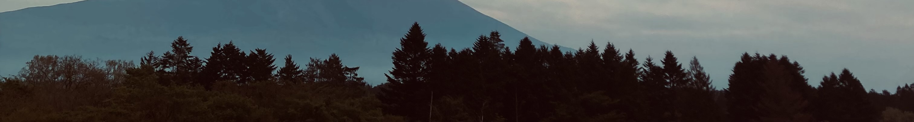

**Nice to meet you**

**はじめまして**

**Enchanté**

> Eng

I'm **Luca**, a French web programmer in Tokyo.

I used to work as a **JP-FR-ENG localizer** in the gaming industry.

I started programming with `tone.js` to program generative synthesizers.

Then I figured out I could use it to **automate** my boring work too.

Then I started doing it for my team. Then for other teams.

Now I am doing it full-time for my division.

I want to move to the next challenge and contribute to great web projects.

_Here is my [portfolio](https://luca-gagliardini.github.io/) to know more!_

> 日本語

東京でウェッブプログラマーとして勤めております、フランスの**ルカ**と申します。

元々は**日仏・日英ローカライザー**として働いていました。

シンセサイザーのオタクで、趣味で`tone.js`を使用してプログラミングし始めたら、git
仕事においても、作業の**自動化**ツールとして使えることに気づき、

しばらくしたら自分のチームのためにもシステムを開発し、

現在は翻訳者を卒業し、部署全体のためにフールタイムでデベロッパーをしていました。

プログラマーの道を続けて、これから新しいチャレンジに向かいたいと思っております。

**詳しくは [ポートフォリオ](https://luca-gagliardini.github.io/)まで！**

